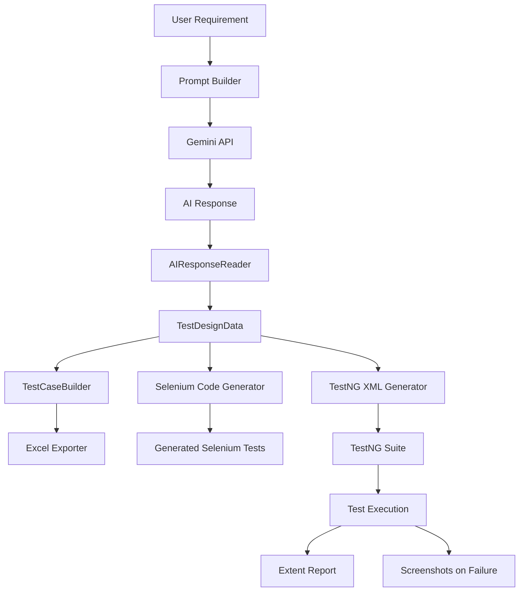

# 🤖 AI Test Design POC


An AI-powered Test Design and Selenium Automation Framework built using **Java**, **TestNG**, **Selenium WebDriver**, and **Google Gemini API**.

This project automatically generates:

- Test Scenarios
- Positive Test Cases
- Negative Test Cases
- Edge Test Cases
- Automation Candidates
- Test Data
- Selenium TestNG Automation Scripts
- TestNG XML
- Excel Test Case Reports

---

# 🚀 Features

- AI-based Test Design using Google Gemini API
- Automatic Selenium Test Script Generation
- TestNG Framework Generation
- Excel Test Case Export
- Extent Report Integration
- Screenshot Capture on Test Failure
- Page Object Model (POM)
- Data Provider Support
- Modular Architecture

---

# 🛠 Tech Stack

| Technology | Usage |
|------------|-------|
| Java 17 | Core Language |
| Selenium WebDriver | UI Automation |
| TestNG | Test Framework |
| Apache POI | Excel Export |
| OkHttp | Gemini API Calls |
| Gson | JSON Parsing |
| Maven | Dependency Management |
| Extent Reports | Reporting |
| Git | Version Control |
| GitHub | Repository Hosting |

---

# 📂 Project Structure

```
src
 ├── main
 │    ├── ai
 │    ├── builder
 │    ├── export
 │    ├── generator
 │    ├── model
 │    ├── pages
 │    ├── prompt
 │    ├── service
 │    └── utils
 │
 └── test
      ├── base
      ├── tests
      └── utils
```

---

# ⚙ Workflow



# 🏗 Project Architecture

The framework follows a modular architecture to keep responsibilities separated.

| Module | Responsibility |
|---------|----------------|
| Prompt Builder | Creates AI prompts from requirements |
| Gemini Service | Sends requests to Google Gemini API |
| AI Response Reader | Parses AI responses |
| TestDesignData | Stores structured test information |
| TestCaseBuilder | Builds Positive, Negative, Edge and Automation scenarios |
| SeleniumCodeGenerator | Generates Selenium TestNG automation |
| ExcelExporter | Exports structured test cases into Excel |
| TestNGXmlGenerator | Generates TestNG XML automatically |
| BaseTest | Common Selenium setup |
| TestListener | Generates Extent Reports and screenshots |

# ▶ How to Run

Clone the repository

```bash
git clone https://github.com/jayadevmurkal/AI-Test-Design-POC.git
```

Go to the project

```bash
cd AI-Test-Design-POC
```

Install dependencies

```bash
mvn clean install
```

Run the project

```bash
mvn exec:java
```

Run automation tests

```bash
mvn test
```

---

# 📊 Output

The framework generates:

- Selenium Test Scripts
- TestNG XML
- Excel Reports
- Extent Reports
- Screenshots on Failure

---

# 🔮 Future Enhancements

- OpenAI Integration
- Claude Integration
- Playwright Code Generation
- REST Assured Automation
- Cypress Automation
- Docker Support
- Parallel Execution
- Jira Integration
- TestRail Integration

---

# 👨‍💻 Author

**Jayadev Murkal**

QA Automation Engineer

GitHub:
https://github.com/jayadevmurkal

---