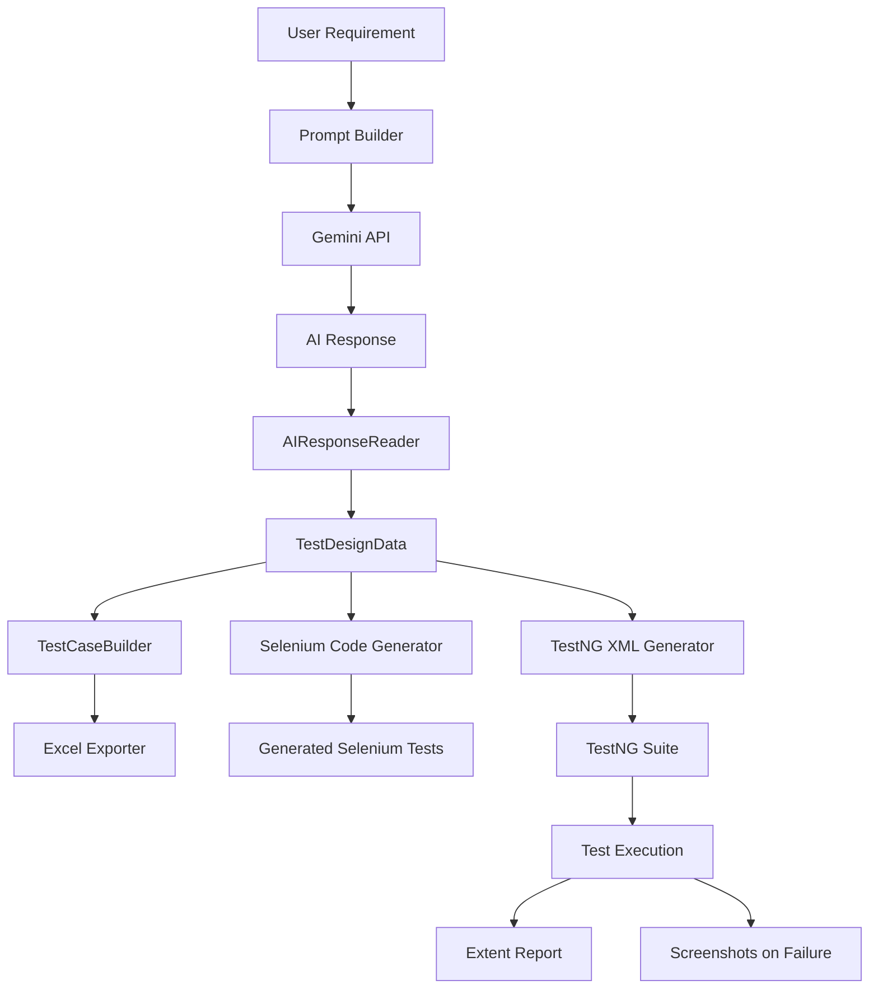
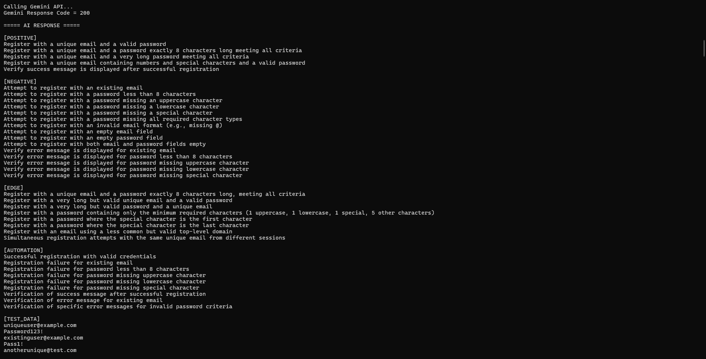
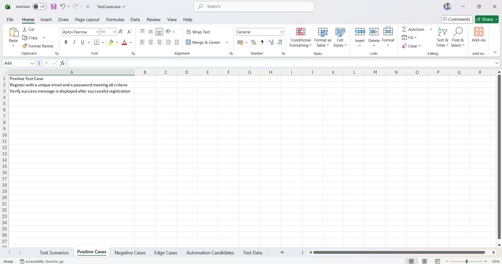
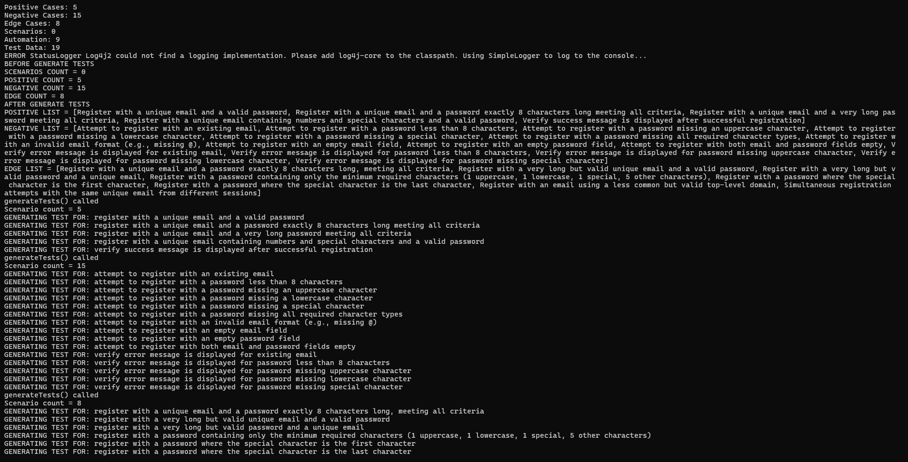
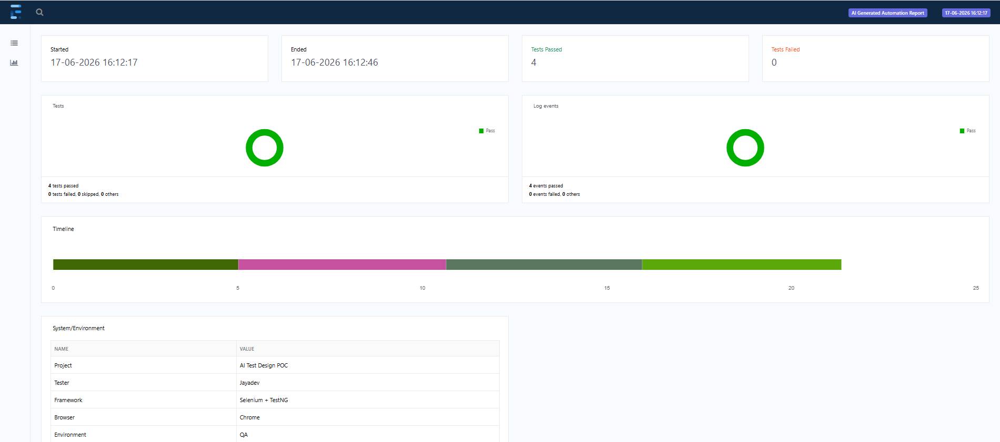
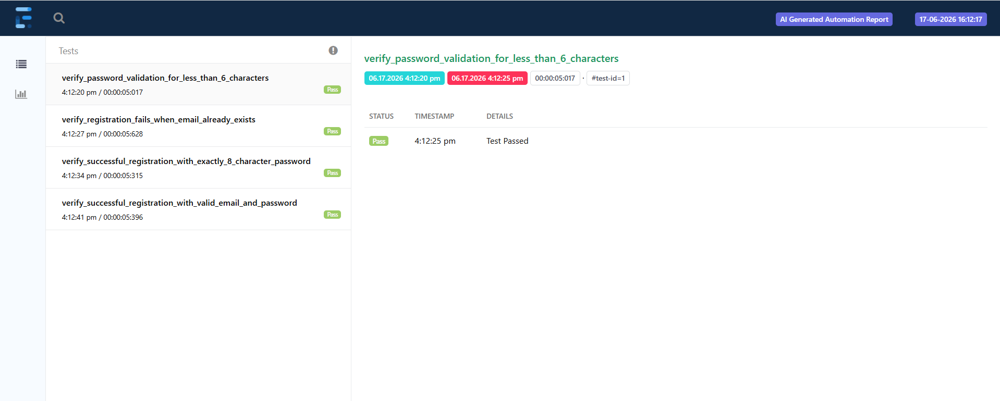

# 🤖 AI Test Design POC


An AI-powered Test Design and Selenium Automation Framework that analyzes software requirements using **Google Gemini AI** and automatically generates structured test cases, Selenium TestNG automation scripts, Excel reports, and TestNG execution suites.

**Built as a Proof of Concept (POC) to demonstrate how Generative AI can accelerate software test design and automation generation.**

## 🎯 The Framework Automatically Generates

- Test Scenarios
- Positive Test Cases
- Negative Test Cases
- Edge Test Cases
- Automation Candidates
- Test Data
- Selenium TestNG Automation Scripts
- TestNG XML
- Excel Test Case Reports

---

## 💡 Why this Project?

Writing high-quality manual test cases and automation scripts can be repetitive, time-consuming, and prone to inconsistencies.

This project demonstrates how Generative AI (Google Gemini) can accelerate the QA lifecycle by automatically generating:

- Test Cases
- Test Data
- Selenium Automation
- TestNG Suite
- Excel Reports
- Execution Reports

This proof of concept showcases the integration of AI with modern QA Automation frameworks.

## 🚀 Features

- 🤖 AI-powered Requirement Analysis using Google Gemini API
- ✅ Positive Test Case Generation
- ❌ Negative Test Case Generation
- ⚠ Edge Case Generation
- 🎯 Automation Candidate Identification
- 📊 Excel Test Case Export
- 🧪 Selenium TestNG Automation Generation
- 📄 Automatic TestNG XML Generation
- 📸 Screenshot Capture on Test Failure
- 📈 Extent Report Generation
- 🏗 Modular Framework Architecture
- 📦 Page Object Model (POM)
- 🔄 TestNG DataProvider Support

---

## 🛠 Tech Stack
---
| Technology | Usage |
|------------|-------|
| Java 17 | Core Language |
| Selenium WebDriver | UI Automation |
| TestNG | Test Framework |
| Apache POI | Excel Export |
| OkHttp | Gemini API Calls |
| Gson | JSON Parsing |
| Maven | Dependency Management |
| Extent Reports | Reporting |
| Git | Version Control |
| GitHub | Repository Hosting |
---

## 📂 Project Structure

```text
AI-Test-Design-POC
│
├── src/main/java
│   ├── ai
│   ├── builder
│   ├── export
│   ├── generator
│   ├── model
│   ├── pages
│   ├── prompt
│   ├── service
│   └── utils
│
├── src/test/java
│   ├── base
│   ├── tests
│   └── utils
│
├── reports
├── screenshots
├── pom.xml
└── README.md
```

## ⚙ Workflow



## 🏗 Project Architecture

The framework follows a modular architecture to keep responsibilities separated.
---
| Module | Responsibility |
|---------|----------------|
| Prompt Builder | Creates AI prompts from requirements |
| Gemini Service | Sends requests to Google Gemini API |
| AI Response Reader | Parses AI responses |
| TestDesignData | Stores structured test information |
| TestCaseBuilder | Builds Positive, Negative, Edge and Automation scenarios |
| SeleniumCodeGenerator | Generates Selenium TestNG automation |
| ExcelExporter | Exports structured test cases into Excel |
| TestNGXmlGenerator | Generates TestNG XML automatically |
| BaseTest | Common Selenium setup |
| TestListener | Generates Extent Reports and screenshots |
---

## Project Screenshots

### 📸 AI Generated Test Cases
---
The framework analyzes software requirements using Google Gemini AI and automatically generates structured test cases.


---

### 📊 Excel Test Case Export
---
Generated Positive, Negative, Edge, Automation Candidate and Test Data sheets.


---

### 🧪 Generated Selenium Automation
---
Automatically creates Selenium TestNG automation using Page Object Model.


---

### 📈 Extent Report Dashboard
---
Execution results are displayed using Extent Reports.


---

### 📄 Detailed Execution Report
---
Each generated automation test is executed and reported.


---

## 📝 Sample Requirement

```text
The application shall allow users to register using email and password.

Email must be unique.

Password must contain at least 8 characters.

The application shall display a success message after successful registration.
```


## ▶ How to Run

### 1. Clone the repository

```bash
git clone https://github.com/jayadevmurkal/AI-Test-Design-POC.git
```

### 2. Open the project

```bash
cd AI-Test-Design-POC
```

### 3. Install dependencies

```bash
mvn clean install
```

### 4. Configure Gemini API

Create the following file:

```text
src/main/resources/config.properties
```

Add your Gemini API key:

```properties
gemini.api.key=YOUR_API_KEY
```

### 5. Generate AI Test Design

This command will:
- Call the Gemini API
- Generate test cases
- Generate Selenium scripts
- Generate Excel reports
- Generate TestNG XML

```bash
mvn exec:java
```

### 6. Run the generated automation tests

After the automation scripts are generated, execute them using:

```bash
mvn test
```

After execution, you can view:
- 📊 Extent Report
- 📸 Failure Screenshots (if any)
- 📄 TestNG Report

---

## 📋 End-to-End Workflow
---
1. User enters software requirement.
2. Gemini AI analyzes the requirement.
3. AI generates:
   - Positive Test Cases
   - Negative Test Cases
   - Edge Cases
   - Automation Candidates
   - Test Data
4. Framework generates:
   - Selenium TestNG scripts
   - TestNG XML
   - Excel Reports
5. Tests are executed.
6. Extent Report is generated automatically.
---

## 📊 Generated Outputs
---
The framework automatically generates the following artifacts:

- ✅ Positive Test Cases
- ✅ Negative Test Cases
- ✅ Edge Test Cases
- ✅ Automation Candidates
- ✅ Test Data
- ✅ Selenium TestNG Automation
- ✅ TestNG XML
- ✅ Excel Reports
- ✅ Extent Reports
- ✅ Failure Screenshots
---

## 🔮 Future Enhancements
---
- [ ] Playwright Automation Generation
- [ ] REST Assured Test Generation
- [ ] OpenAI Integration
- [ ] Claude Integration
- [ ] Docker Support
- [ ] GitHub Actions CI/CD
- [ ] Parallel Execution
- [ ] Jira Integration
- [ ] TestRail Integration
---

## 📄 License
---
This project is licensed under the MIT License.
---

## 👨‍💻 Author

**Jayadev Murkal**

QA Automation Engineer | Java | Selenium | TestNG | API Testing | AI Test Automation

**GitHub:** <https://github.com/jayadevmurkal>

**Repository:** <https://github.com/jayadevmurkal/AI-Test-Design-POC>

⭐ If you found this project useful, please consider giving it a star.